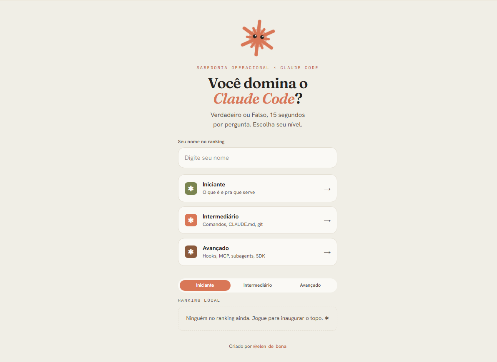

<div align="center">

# ✱ Quiz Claude Code

### Você domina o Claude Code?

Quiz web gamificado de **Verdadeiro ou Falso** sobre o Claude Code — três níveis,
timer, bônus de velocidade, streak, patentes e ranking local.

<a href="https://trilha-claudecode-quiz.vercel.app">
  
</a>

**[▶ Jogar agora](https://trilha-claudecode-quiz.vercel.app)**


</div>

---

## Sobre

Um quiz leve e competitivo para a comunidade de IA testar o que sabe sobre o **Claude
Code**. A identidade visual é uma fusão de duas marcas: **@elen_de_bona / Sabedoria
Operacional** × **Claude Code** — com o mascote **Claudinho ✱** (o spark do Claude com
olhinhos), o ícone asterisco recorrente e a paleta creme/terracota.

Tecnologia com leveza, feita para rodar bem no celular e ser fácil de compartilhar.

## Funcionalidades

- **3 níveis** — Iniciante (o que é e pra que serve), Intermediário (comandos,
  `CLAUDE.md`, git) e Avançado (hooks, MCP, subagents, SDK).
- **Partida** de 10 perguntas sorteadas de um banco de 20 por nível, embaralhadas.
- **Timer de 15s** por pergunta, com o anel-timer ao redor do Claudinho e urgência
  visual nos últimos 5 segundos.
- **Pontuação** com bônus de velocidade e multiplicador de streak.
- **Patentes** conquistadas por faixa de pontuação.
- **Ranking local** (top 10 por nível), salvo no navegador — sem backend.
- **Compartilhamento** estilo Wordle (texto + emojis) via Web Share API / área de
  transferência.
- **Feedback imediato** com explicação educativa após cada resposta.
- **Mobile-first**, acessível (botões grandes, foco visível, teclas **V** / **F**) e
  com `prefers-reduced-motion` respeitado.

## Como funciona

### Pontuação

| Evento | Pontos |
|---|---|
| Acerto (base) | **100** |
| Bônus de velocidade | **+5** por segundo restante (máx. **+75**) |
| Streak ≥ 3 acertos seguidos | multiplicador **1,5×** |
| Streak ≥ 5 acertos seguidos | multiplicador **2×** |
| Erro ou tempo esgotado | **0** — e zera o streak |

### Patentes

| Pontuação | Patente |
|---|---|
| 0 – 900 | 🧭 Explorador(a) Curioso(a) |
| 901 – 1800 | ✱ Praticante de Prompts |
| 1801 – 2600 | 🤖 Dev Assistido(a) por IA |
| 2601+ | 🏆 Claude Master |

## Stack

- **[Next.js 16](https://nextjs.org)** (App Router) + **TypeScript**
- **[Tailwind CSS v4](https://tailwindcss.com)** (tokens via `@theme`)
- Estado com **React hooks** (`useReducer`) — sem lib de estado externa
- Persistência em **`localStorage`** — sem backend, sem banco
- Fontes via **`next/font`**: Fraunces (display), Hanken Grotesk (corpo), Space Mono (números)
- Deploy na **[Vercel](https://vercel.com)**

## Estrutura

```
.
├── app/
│   ├── layout.tsx            # fontes + metadata
│   ├── page.tsx              # tela inicial (nível + nome + ranking)
│   ├── quiz/[level]/page.tsx # a partida (máquina de estados + timer)
│   └── globals.css           # design tokens (@theme) + animações
├── components/
│   ├── Claudinho.tsx         # o mascote ✱
│   ├── Timer.tsx             # anel de contagem regressiva
│   ├── QuestionCard.tsx      # afirmação + botões V/F
│   ├── FeedbackPanel.tsx     # acerto/erro + explicação
│   ├── ScoreBoard.tsx        # progresso, streak e pontos
│   ├── Ranking.tsx           # ranking local
│   └── ResultScreen.tsx      # patente + share + ranking
├── lib/
│   ├── scoring.ts            # pontos, bônus, streak, patentes
│   ├── shuffle.ts            # sorteio das 10 perguntas
│   ├── storage.ts            # ranking no localStorage
│   └── types.ts              # tipos e metadados dos níveis
└── data/
    └── questions.json        # banco de 60 perguntas (20 por nível)
```

## Rodando localmente

```bash
npm install
npm run dev      # http://localhost:3000
```

Outros comandos:

```bash
npm run build    # build de produção (roda o typecheck do TypeScript)
npm start        # serve o build de produção
npm run lint     # ESLint
```

## Banco de perguntas

As 60 perguntas ficam em [`data/questions.json`](data/questions.json), separadas da
lógica. Cada item tem afirmação, resposta e explicação:

```json
{
  "id": "int-01",
  "level": "intermediario",
  "statement": "O arquivo CLAUDE.md é carregado automaticamente no início de cada sessão do Claude Code.",
  "answer": true,
  "explanation": "O CLAUDE.md é lido automaticamente e serve como memória de instruções do projeto."
}
```

Para adicionar perguntas, basta incluir novos objetos no array (mantendo o mix
equilibrado de verdadeiras/falsas e uma explicação em cada uma).

## Deploy

Hospedado na **Vercel** com deploy automático: cada `push` na branch `main`
republica o site. O jogo é 100% client-side — **não requer variáveis de ambiente**.

## Créditos

Criado por **[@elen_de_bona](https://instagram.com/elen_de_bona)** — *Sabedoria
Operacional*. Mascote e identidade em fusão com o **Claude Code** (Anthropic).
